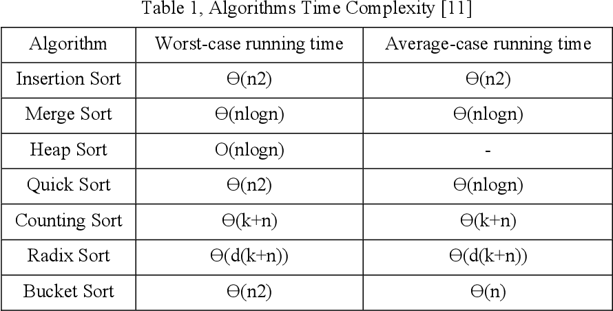

# phosphorous
What better way to learn Python than on DSA.
## Time complexity chart

## Code
[all_unique.py](src/all_unique.py)
[array_reversal_in_place.py](src/array_reversal_in_place.py)
[common.py](src/common.py)
[common_elements_in_two_sorted_arrays.py](src/common_elements_in_two_sorted_arrays.py)
[is_prime.py](src/is_prime.py)
[k_largest_element.py](src/k_largest_element.py)
[n_factorial_the_bad_way.py](src/n_factorial_the_bad_way.py)
[string_permutation.py](src/string_permutation.py)